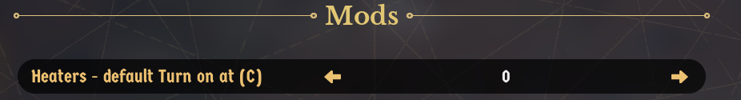

# HeaterDefaults

A quality-of-life mod for [Whiskerwood](https://store.steampowered.com/app/2489330/Whiskerwood/).

Every heater in Whiskerwood starts with **Turn on at ≤ 10 °C**, and the game has no way to change that default. HeaterDefaults lets you pick the starting value once in the Mods settings menu. Every Heating Stove, Bonfire and Radiator you build afterwards gets it automatically.

## Features

- **One setting**: *Heaters - default Turn on at (C)* in the Mods menu, from −30 to 30 °C in 5° steps (default **0**).
- **New heaters only**: Heating Stoves, Bonfires and Radiators built while the mod is active. Heaters that already exist when a save loads are never changed, and neither are heaters you have adjusted yourself.
- **Uses the game's own command**: the same one the heater window's − / + buttons send, so nothing is patched.
- **Event-driven, no polling**: the mod sleeps until a building is placed or a construction finishes, then checks only Heating Stoves and Bonfires (never every building). It costs nothing at 20× speed or in a town with thousands of buildings.
- Temporary campfires are left alone.

## Installing

- **Manually:** put `HeaterDefaults.pak` and `HeaterDefaults.uplugin` in
  `%localappdata%\Whiskerwood\Saved\mods\HeaterDefaults\` (create the folder; file names must stay `HeaterDefaults.*`).
- Then choose your temperature under **Settings → Mods**. A change applies to heaters built after it.

## Repository layout

| Path | What |
|---|---|
| `Mod/HeaterDefaults/` | The mod's source assets (`.uasset`) and `HeaterDefaults.uplugin`. This is the whole mod. |
| `docs/graphs/` | Blueprint graphs as copy-paste text (T3D). Reference only: the `.uasset` files are the source of truth. |
| `tools/` | `t3d.py` + `heaterdefaults_build.py`: Python generator that writes the graphs in `docs/graphs/` from the modkit's reflection dump. |
| `docs/screenshot.png` | Screenshot, also used as the Workshop preview image. |
| `workshop/` | SteamCMD item file (`HeaterDefaults.vdf`) and [upload steps](workshop/HOW_TO_UPLOAD.md). |
| `sync-from-modkit.bat` | Copies the mod's assets from the modkit into this repo and stages the built `.pak` + uplugin into `workshop/content/`. |
| `sync-to-steam.bat` | Uploads `workshop/content/` to the Workshop with SteamCMD. |

## Building from source

1. Set up the official [Whiskerwood modkit](https://github.com/Whiskerwood-Modding/Whiskerwood-Project) (custom UE 5.8 build, branch `5.8`, see its README).
2. Copy `Mod/HeaterDefaults/` from this repo to `Content/Mods/HeaterDefaults/` in the modkit project. (Assets saved by the old UE 5.6 modkit crash the 5.8 editor; if that happens, recreate `BP_Startup` / `BP_MapLoad` from `docs/graphs/` as below.)
3. Open the project, right-click the `HeaterDefaults` folder → **Cook & Install** (Mod Tools). The mod uses pak chunk 8 (`PAL_HeaterDefaults`).
4. After editing in the editor, run `sync-from-modkit.bat` to copy the changed assets back into `Mod/HeaterDefaults/`, then commit.
   The script assumes the modkit is at `E:\modding\Whiskerwood-Project`; override with `set MODKIT=D:\other\path` first.

### Regenerating a graph

`python tools/heaterdefaults_build.py` writes fresh paste text into `tools/out/`. It needs the modkit's `Content/DynamicClasses/Whiskerwood-*.jmap.gz`; set `JMAP=...` if it isn't next to this repo. In the asset's event graph: Ctrl+A, Delete, Ctrl+V, then compile. Steps the generator can't reproduce:

- `BP_MapLoad` variables must exist before pasting: `Debug` (Boolean), `View` (UI Heater View reference), `Known` (Actor array), `Retries` and `KnownBefore` (Integer), `Cur` and `Built` (Actor reference), `SingleMode`, `LoadScan` and `Ready` (Boolean).
- No class dropdowns to set: the Heater and bonfire classes are loaded from their path strings (`LoadClassAsset_Blocking`), because class pins pointing at game Blueprints paste empty.
- If a red event wire (OnLoaded, OnConstruction, OnBuilt, OnSiteGone → its *Bind Event* node) pastes unconnected, drag it again.

## How it works

| Asset | Role |
|---|---|
| `BP_Startup` | Runs once at the main menu and registers the mod option `HeaterDefaults_TurnOnAt`. |
| `BP_MapLoad` | Runs when a game starts or a save loads. It binds the mod API events and handles new heaters (below). |
| `PAL_HeaterDefaults` | Primary Asset Label that puts the mod into its own pak chunk. |

- A heater's *Turn on at* limit is stored per heater (`FueledHeater`), and the 10 °C default comes from global heat settings, not a data table, so a data-table mod can't change it.
- The heater window class (`UI_HeaterView`) accepts a `setAutopauseLimit` action with an exact value. `BP_MapLoad` keeps one invisible `UI_HeaterView` and points its `Context` at a heater with `SetObjectPropertyByName` (the property isn't Blueprint-writable). It reads `CalcHudState` (current value, and whether it differs from the default), then sends the action. The value is `(°C + 30) × 3 + HeatIncrementU8`.
- **When the mod runs:**
  - **Game started / save loaded:** every existing Heating Stove and Bonfire is remembered, and nothing is changed. This runs at `BeginPlay` (a new game doesn't send `onLoadingFinished` to the mod) and again at `onLoadingFinished` (in a loaded save the buildings may not exist yet at `BeginPlay`).
  - **`onBuildingSpawned`:** buildings placed instantly, such as the Radiator. The mod handles exactly that building.
  - **`onConstructionSpawned`:** the mod binds that construction site's `OnDestroyed`. When the site disappears (finished or cancelled), a one-shot 1-second timer lists only `Heater_C` and `bonfire_C` actors and handles the ones it hasn't seen yet. If none is new, it retries up to three times. `onBuildingSpawned` doesn't fire for buildings finished through construction in game version 0.7.207.
## Debug logging

The mod is silent by default. To see what it does, create `%localappdata%\Whiskerwood\Saved\mods\HeaterDefaultsConfig\debug.txt` with any text in it (an empty file counts as off). Then when a game starts or a save loads it writes `HeaterDefaults ready`, and one line for every heater it changes, to `%localappdata%\Whiskerwood\Saved\Logs\modlog.txt`. It has its own folder because Cook & Install and Workshop updates replace the mod's folder; Workshop copies never contain it.

## Known limitations

- The heater window's *reset* button still returns to the game's 10 °C; a mod can't change where it points.
- Changing the setting applies only to heaters built after the change.
- A heater type added in a future game version needs adding to the class list in `BP_MapLoad`.

## Version history

- **1.1** – works properly in a new game: heaters that came with the map are remembered at start and left alone (before, only loaded saves did this). Debug switch moved to `HeaterDefaultsConfig\debug.txt`.
- **1.0** – first release (re-uploaded with `EngineVersion 5.8` so the game loads it).

## Credits

Created using the Whiskerwood modkit: https://github.com/Whiskerwood-Modding/Whiskerwood-Project
